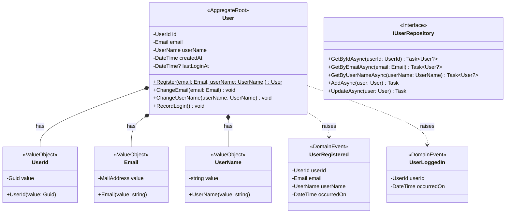

# Users Domain Design

## Overview

The Users module represents the User Management bounded context within Pertified, a project planning and estimation system. This module is responsible for managing user identities, authentication, and basic user information within the system. It serves as the central authority for all user-related operations and maintains user state throughout the application lifecycle.

## Domain Model

### Mermaid Class Diagram

## Domain Objects Documentation

### User (Aggregate Root)

**Short Overview**: The User aggregate root represents a system user with their basic identity and authentication information within the Pertified project planning system.

**Invariants & Domain Logic**:
- Username must be between 3-50 characters and contain only alphanumeric characters, hyphens, and underscores
- Last login timestamp is updated only when user successfully authenticates

### UserId (Value Object)

**Short Overview**: Strongly typed identifier for User entities that wraps a Guid to provide type safety and prevent primitive obsession.

**Invariants & Domain Logic**:
- Must contain a valid, non-empty Guid value
- Immutable once created
- Provides value equality semantics
- Used consistently across all user-related operations to maintain type safety

### Email (Value Object)

**Short Overview**: Wraps the .NET `MailAddress` class to provide a domain-specific email representation with potential for additional validation rules and business logic.

**Invariants & Domain Logic**:
- Must contain a valid MailAddress (validated by System.Net.Mail.MailAddress)
- Immutable once created
- Provides value equality semantics
- Allows for future extension with domain-specific email validation rules

### UserName (Value Object)

**Short Overview**: Represents a user's chosen display name with validation rules appropriate for a professional project planning environment.

**Invariants & Domain Logic**:
- Must be between 3-50 characters in length
- Can contain only alphanumeric characters, hyphens, and underscores
- Cannot start or end with hyphen or underscore
- Case-sensitive for display but case-insensitive for uniqueness checks

### Domain Events

#### UserRegistered

**Short Overview**: Raised when a new user successfully completes the registration process and is added to the system.

#### UserLoggedIn

**Short Overview**: Raised when a user successfully authenticates, enabling activity tracking and security monitoring.

### Repository Interface

#### IUserRepository

**Short Overview**: Defines the contract for User aggregate persistence and retrieval operations following repository pattern principles.