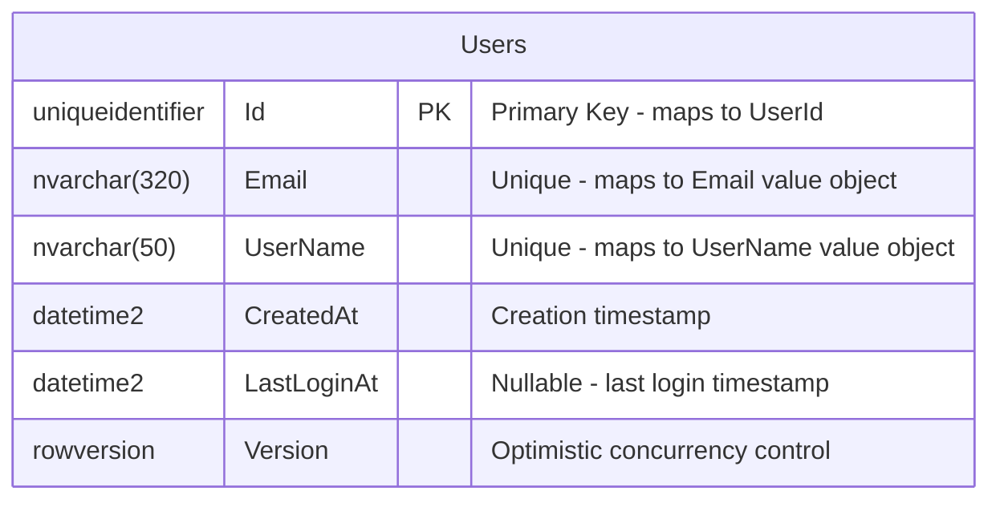

# Users Module Database Design Plan

## Overview

This document provides a comprehensive database design plan for the Users module in the Pertified modular monolith project. The design is based on the Domain-Driven Design (DDD) model implemented in the Users.Domain project and follows Clean Architecture principles with CQRS pattern support.

## Domain Model Analysis

The Users module contains the following domain objects:

### Aggregate Root
- **User** - The main aggregate root representing a system user

### Value Objects
- **UserId** - Strongly-typed identifier wrapping a Guid
- **Email** - Email address validation wrapper around MailAddress
- **UserName** - Username with specific validation rules

### Domain Events
- **UserRegisteredEvent** - Raised when a user registers
- **UserLoggedInEvent** - Raised when a user logs in

## Database Schema Design

### Entity Relationship Diagram



## Table Specifications

### Users Table

The primary table storing User aggregate data.

```sql
CREATE TABLE [Users].[Users] (
    [Id] UNIQUEIDENTIFIER NOT NULL DEFAULT NEWID(),
    [Email] NVARCHAR(320) NOT NULL,
    [UserName] NVARCHAR(50) NOT NULL,
    [CreatedAt] DATETIME2(7) NOT NULL,
    [LastLoginAt] DATETIME2(7) NULL,
    [Version] ROWVERSION NOT NULL,
    
    CONSTRAINT [PK_Users] PRIMARY KEY ([Id]),
    CONSTRAINT [UQ_Users_Email] UNIQUE ([Email]),
    CONSTRAINT [UQ_Users_UserName] UNIQUE ([UserName]),
    CONSTRAINT [CK_Users_Email_Length] CHECK (LEN([Email]) >= 5),
    CONSTRAINT [CK_Users_UserName_Length] CHECK (LEN([UserName]) >= 3),
    CONSTRAINT [CK_Users_UserName_Format] CHECK ([UserName] LIKE '[a-zA-Z0-9]%[a-zA-Z0-9]' OR LEN([UserName]) = 1)
);
```

#### Column Details

| Column | Type | Nullable | Description |
|--------|------|----------|-------------|
| `Id` | UNIQUEIDENTIFIER | No | Primary key mapping to UserId value object |
| `Email` | NVARCHAR(320) | No | Email address with unique constraint |
| `UserName` | NVARCHAR(50) | No | Username with unique constraint |
| `CreatedAt` | DATETIME2(7) | No | User creation timestamp |
| `LastLoginAt` | DATETIME2(7) | Yes | Last successful login timestamp |
| `Version` | ROWVERSION | No | Optimistic concurrency control |

#### Constraints and Business Rules

1. **Email Uniqueness**: Ensures no two users can have the same email address
2. **UserName Uniqueness**: Ensures no two users can have the same username
3. **Email Length**: Must be at least 5 characters (basic validation)
4. **UserName Length**: Must be at least 3 characters (matches domain validation)
5. **UserName Format**: Basic check for alphanumeric start/end (simplified from regex)

## Indexing Strategy

### Performance Indexes

```sql
-- Primary access patterns for User lookups
CREATE NONCLUSTERED INDEX [IX_Users_Email] ON [Users].[Users] ([Email]);
CREATE NONCLUSTERED INDEX [IX_Users_UserName] ON [Users].[Users] ([UserName]);

-- Activity tracking and reporting
CREATE NONCLUSTERED INDEX [IX_Users_CreatedAt] ON [Users].[Users] ([CreatedAt]);
CREATE NONCLUSTERED INDEX [IX_Users_LastLoginAt] ON [Users].[Users] ([LastLoginAt]) WHERE [LastLoginAt] IS NOT NULL;
```

### Index Rationale

1. **Email/UserName Indexes**: Support the repository methods `GetByEmailAsync` and `GetByUserNameAsync`
2. **CreatedAt Index**: Enables efficient user registration date queries
3. **LastLoginAt Filtered Index**: Optimizes queries for active users (filtered to exclude nulls)

## CQRS Design Considerations

### Command Side (Writes)

The primary `Users` table serves as the write model for all command operations:

- **User Registration**: INSERT into Users table
- **Email Changes**: UPDATE Users.Email with validation
- **Username Changes**: UPDATE Users.UserName with uniqueness checks
- **Login Recording**: UPDATE Users.LastLoginAt

### Query Side (Reads)

For optimal read performance, consider these patterns:

#### User Profile Queries
```sql
-- Optimized for user profile display
SELECT Id, Email, UserName, CreatedAt, LastLoginAt
FROM [Users].[Users]
WHERE Id = @UserId;
```

#### User Search and Listing
```sql
-- Optimized for user management interfaces
SELECT Id, Email, UserName, CreatedAt, LastLoginAt,
       CASE WHEN LastLoginAt IS NOT NULL THEN 1 ELSE 0 END as HasLoggedIn
FROM [Users].[Users]
ORDER BY CreatedAt DESC
OFFSET @Skip ROWS FETCH NEXT @Take ROWS ONLY;
```

#### Activity Reports
```sql
-- User activity statistics
SELECT 
    CAST(CreatedAt AS DATE) as RegistrationDate,
    COUNT(*) as NewUsers,
    COUNT(LastLoginAt) as ActiveUsers
FROM [Users].[Users]
WHERE CreatedAt >= @FromDate
GROUP BY CAST(CreatedAt AS DATE)
ORDER BY RegistrationDate;
```

## Entity Framework Configuration

### User Entity Configuration

```csharp
public class UserConfiguration : IEntityTypeConfiguration<User>
{
    public void Configure(EntityTypeBuilder<User> builder)
    {
        builder.ToTable("Users", "Users");
        
        // Primary Key
        builder.HasKey(u => u.Id);
        builder.Property(u => u.Id)
            .HasConversion(
                id => id.Value,
                value => new UserId(value));
        
        // Email Value Object
        builder.Property(u => u.Email)
            .HasMaxLength(320)
            .HasConversion(
                email => email.Value.Address,
                value => Email.Create(value).Value);
        builder.HasIndex(u => u.Email).IsUnique();
        
        // UserName Value Object
        builder.Property(u => u.UserName)
            .HasMaxLength(50)
            .HasConversion(
                userName => userName.Value,
                value => UserName.Create(value).Value);
        builder.HasIndex(u => u.UserName).IsUnique();
        
        // Timestamps
        builder.Property(u => u.CreatedAt)
            .HasColumnType("datetime2(7)");
        builder.Property(u => u.LastLoginAt)
            .HasColumnType("datetime2(7)");
        
        // Optimistic Concurrency
        builder.Property<byte[]>("Version")
            .IsRowVersion()
            .HasColumnName("Version");
        
        // Domain Events (not persisted directly)
        builder.Ignore(u => u.DomainEvents);
    }
}
```

## Migration Considerations

### Initial Migration Structure

1. **Schema Creation**: Create the `Users` schema
2. **Table Creation**: Create Users table
3. **Constraints**: Add all business rule constraints
4. **Indexes**: Create all performance indexes
5. **Permissions**: Grant appropriate schema permissions

### Data Migration Strategies

- **Email Normalization**: Ensure all existing emails are lowercase
- **Username Validation**: Validate existing usernames against new format rules
- **Timestamp Standardization**: Ensure all timestamps are UTC

## Security and Compliance

### Data Protection

- **Email Encryption**: Consider column-level encryption for PII
- **Soft Deletes**: Consider implementing soft deletes for compliance

### Performance Monitoring

- **Index Usage**: Monitor index effectiveness with DMVs
- **Query Performance**: Track slow query patterns

## Module Boundary Considerations

### Data Isolation

- **Schema Separation**: Uses dedicated `Users` schema
- **Cross-Module Access**: Only through Contracts project interfaces
- **Domain Events**: Will be handled through application layer patterns when added later

### Integration Points

- **Future Integration**: Outbox pattern will be added later for reliable event publishing
- **Read Models**: Other modules can subscribe to user events for their read models
- **API Endpoints**: User data exposed only through Users module controllers

## Future Enhancements

- **Outbox Pattern**: Will be implemented later for reliable domain event publishing
- **Event Sourcing**: Consider for complete audit trail if needed
- **Read Model Optimization**: Separate read models for complex queries if performance requires

## Conclusion

This database design provides a robust foundation for the Users module that:

- Maps directly to the domain model without impedance mismatch
- Supports both CQRS command and query patterns efficiently
- Maintains data consistency with proper constraints and transactions
- Scales with appropriate indexing strategies
- Maintains module boundaries in the modular monolith architecture
- Provides a simple starting point that can be enhanced with outbox pattern later

The design follows Entity Framework conventions while preserving the rich domain model and supporting the architectural patterns used throughout the Pertified system.